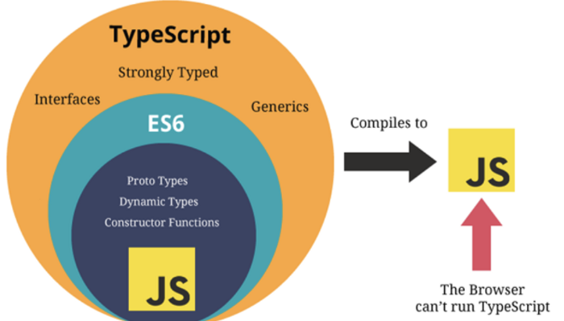
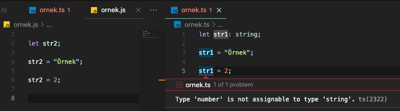

# 1. Ödev - TypeScript ile JavaScript Arasındaki Farklar

Bu ödevde öncelikle JavaScript ve TypeScript'in ne olduklarını kısaca açıklayacağım. Ardından aralarındaki farklara değineceğim.

## İçindekiler
1. [JavaScript nedir?](#javascript-nedir)
2. [TypeScript nedir?](#typescript-nedir)
3. [TypeScript vs JavaScript](#typescript-vs-javascript)
4. [Kaynaklar](#kaynaklar)

## JavaScript Nedir?

[JavaScript](https://www.javascript.com/), yaygın olarak web tarayıcılarında kullanılmakta olan, web sayfalarına canlılık ve dinamiklik getirmek için oluşturulmuş, dinamik bir programlama/betik(script) dilidir.

JavaScript ile yazılan istemci tarafı betikler sayesinde tarayıcının kullanıcıyla etkileşimde bulunması, tarayıcının kontrol edilmesi, asenkron bir şekilde sunucu ile iletişime geçilmesi ve web sayfası içeriğinin değiştirilmesi gibi işlevler sağlanır. JavaScript, Node.js gibi platformlar sayesinde sunucu tarafında da yaygın olarak kullanılmaktadır.

JavaScript prototip-tabanlı, dinamik türlere ve birinci-sınıf fonksiyonlara sahip bir betik dilidir. Nesne yönelimli, imperatif ve fonksiyonel programlama prensiplerine sahiptir. ([1](#1))

## TypeScript Nedir?

Microsoft çalışanı ve C# dilinin tasarımcısı olan [Anders Hejlsberg](https://en.wikipedia.org/wiki/Anders_Hejlsberg) tarafından tasarlanmış, ilk sürümü 2012 yılında yayınlanan strongly-typed (değişkenlerin değerlerinin türlerine uyumlu olup olmadığının kontrol edilme özelliği), nesne yönelimli ve derlenebilir açık kaynaklı bir programlama dilidir. ([2](#2))

[Typescript](https://www.typescriptlang.org/), JavaScript ile daha hatasız ve anlaşılır kod geliştirmemizi sağlayan bir ortamdır diyebiliriz.

## TypeScript vs JavaScript

Aslında, TypeScript ve JavaScript'e baktığımızda pek çok benzerlik var. Her ikisi de etkileşimli web sayfaları oluşturmak için kullanılır.

TypeScript JavaScript’deki bazı eksiklikleri gidermek üzere ortaya çıkmış bir dildir. Var olan JavaScript dili üzerinden geliştirilmiştir. Bu nedenle TypeScript JavaScript’i içinde barından büyük bir kümedir diyebiliriz. TypeScript ile yazılan kodlar web tarayıcları tarafından direk çalıştırılamaz. Bu nedenle önce JavaScript koduna derlenmeleri gerekir. ([3](#3))

TypeScript strongly-typed bir dildir. Bu sayede daha anlaşılır ve hatasız kodlar yazabiliriz. Örneğin aşağıda aynı kodun JavaScript ve TypeScript ile yazılmış halini görüyoruz.

Örnekte gördüğünüz üzere string tipi ile tanımlanmış değişkene JavaScript de bir number tipinde değişken atadığımızda herhangi bir hata vermezken, TypeScript sayesinde daha kodu yazarken anında bu hatayı görebiliyoruz.

***

|                       |                                                                              TypeScript                                                                              |                                   JavaScript                                   |
|:---------------------:|:--------------------------------------------------------------------------------------------------------------------------------------------------------------------:|:------------------------------------------------------------------------------:|
|         Tanım         | Özellikle büyük ve karmaşık projeler için kod zorluğunun üstesinden gelmek, daha anlaşılır ve hatasız kod yazabilmek için oluşturulmuş bir JavaScript üst kümesidir. | JavaScript, dinamik web sayfaları oluşturmaya yardımcı olan bir betik dilidir. |
|    Strongly-Typed?    |                                                                                 Evet                                                                                 |                                      Hayır                                     |
|       Interface?      |                                                                                 Evet                                                                                 |                                      Hayır                                     |
| Derleyici gereksinimi |                                                               TypeScript kodunun derlenmesi gerekiyor.                                                               |                  JavaScript'te kod derleme zorunluluğu yoktur.                 |
|    Dosya Uzantıları   |                                                                              .tsx ve .ts                                                                             |                                       .js                                      |
|        Topluluk       |                                               TypeScript, daha küçük bir yazılım geliştiricileri topluluğuna sahiptir.                                               |       JavaScript, geniş bir yazılım geliştiricileri topluluğuna sahiptir.      |

***

> Sonuç olarak, TypeScript ve JavaScript arasındaki farka bakıldığında, her iki teknolojinin de avantaj ve dezavantajlarının olduğu söylenebilir.
>
>JavaScript kapsamlı bir kodlama dili olmayabilir, ancak web tarayıcılar tarafından otomatik olarak tanınır ve yazması nispeten daha kolaydır.
>
>TypeScript ise temiz, güzel, kompakt ve okunabilir kod üretmek isteyen geliştiriciler için tercih edilen bir seçenektir. TypeScript'in sunduğu çeşitli canlı hata denetimi ve statik yazma avantajları da göz önüne alındığında özellikle büyük çaplı projelerde tercih edilmesi oldukça mantıklıdır.

## Kaynaklar

#### 1

[https://tr.wikipedia.org/wiki/JavaScript](https://tr.wikipedia.org/wiki/JavaScript)

#### 2

[https://en.wikipedia.org/wiki/TypeScript](https://en.wikipedia.org/wiki/TypeScript)

#### 3

[https://medium.com/geekculture/typescript-vs-javascript-e5af7ab5a331](https://medium.com/geekculture/typescript-vs-javascript-e5af7ab5a331)

#### 4

[https://www.javascript.com/](https://www.javascript.com/)

#### 5

[https://www.typescriptlang.org/](https://www.typescriptlang.org/)